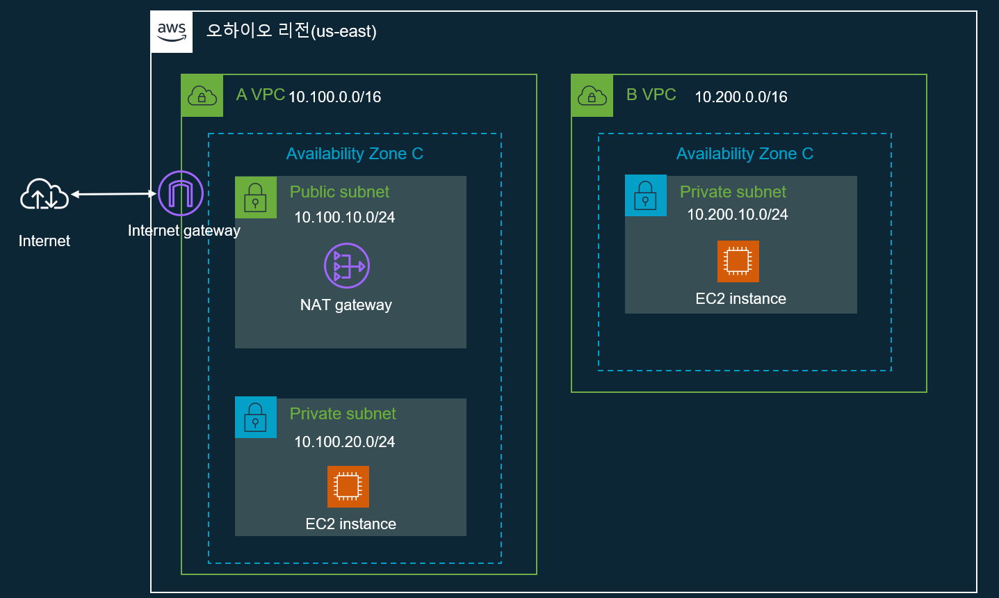

# 개요
* 테라폼 vpc연습



# 준비
* aws 프로파일을 환경변수로 설정(또는 $HOME/.aws로 관리)
* ohio 리전 사용
```sh
export AWS_ACCESS_KEY_ID=""
export AWS_SECRET_ACCESS_KEY=""
export AWS_DEFAULT_REGION="us-east-2"
```

# 실행
```sh
terraform init
terraform plan
terraform apply
```

# 삭제
```sh
terraform destroy
```